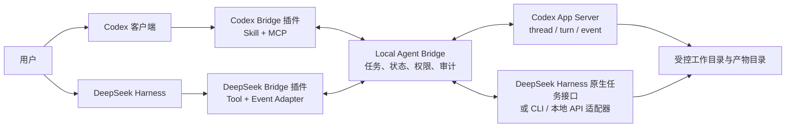
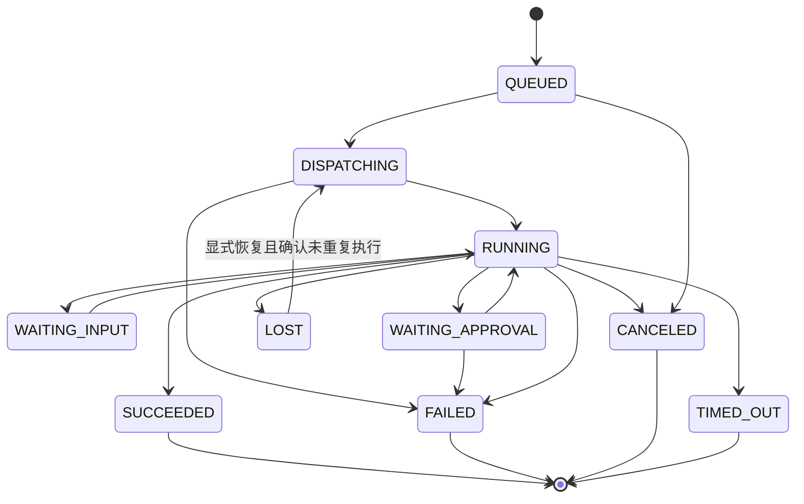

# Codex 与 DeepSeek Harness 本地双向协作系统需求文档

## 1. 文档信息

| 项目 | 内容 |
|---|---|
| 文档版本 | v1.0 |
| 文档日期 | 2026-08-20 |
| 项目代号 | Local Agent Bridge（LAB） |
| 文档状态 | 方案评审稿，可进入技术预研 |
| 目标平台 | macOS 本地环境；后续可扩展 Linux / Windows |

## 2. 背景与问题

用户同时使用本地 Codex 客户端和本地 DeepSeek Harness，希望两个 agent 不只共享文件，还能相互委派任务、持续回传进度、请求补充输入、处理审批，并交付图片等文件产物。

初始设想是在两侧分别开发插件：DeepSeek Harness 插件启动 WebSocket 服务并接收任务；Codex 插件连接该 WebSocket，双方通过消息互相指挥。

这个方向在“进程间实时传输”层面可行，但还不足以完整实现目标：

- WebSocket 只解决消息传输，不解决任务身份、状态机、重试、取消、审批、文件权限和循环委派。
- Codex 插件适合打包 skill、MCP server 和可选 hooks，但插件或 MCP 工具被模型调用，并不等于它能在任意时刻主动唤醒 Codex、向当前桌面会话注入一个新 turn。
- Codex hooks 只在既有生命周期事件发生时运行，不是通用的常驻任务入口。
- 两个插件互为服务器和客户端会造成双主、端口占用、升级顺序、断线恢复和状态一致性问题。

因此，本项目推荐采用“独立本地桥接守护进程 + Codex App Server 适配器 + DeepSeek Harness 适配器 + 两侧轻量插件”的非对称架构。桥接守护进程是唯一任务控制面；两侧 agent 是执行节点。

## 3. 方案结论

### 3.1 推荐方案

### 3.2 对初始方案的评价

| 维度 | 双插件直连 WebSocket | 独立桥接守护进程 |
|---|---|---|
| 基础双向消息 | 可行 | 可行 |
| 主动驱动 Codex | 插件自身难以可靠完成 | 通过 Codex App Server 完成 |
| 状态一致性 | 双主，恢复复杂 | 单一事实源 |
| 插件生命周期 | 容易与连接生命周期耦合 | 插件只做适配和工具暴露 |
| 审批与权限 | 需双方重复实现 | 集中策略，可追踪 |
| 断线续跑 | 难 | SQLite 持久化后可恢复 |
| 协议升级 | 两侧强耦合 | 由桥接层兼容不同版本 |
| 推荐度 | 适合一次性原型 | 适合可长期使用的本地系统 |

### 3.3 必须明确的产品边界

“驱动 Codex”分为两个层级：

1. **P0：驱动 Codex agent runtime。** 外部系统可以创建或恢复 Codex thread、发起 turn、接收流式事件、处理审批并获得产物。这有公开 App Server 能力支撑。
2. **P1：控制当前可见的 Codex 桌面任务。** 包括把消息注入用户此刻正在看的任务、自动切换 UI、让新任务稳定出现在任务列表。这不是 P0 的默认承诺，必须针对当前 Codex 客户端版本做兼容性预研，不能依赖未公开的内部 API。

类似地，“让 Codex 生成图片”要求被桥接启动的 Codex runtime 确实拥有图片生成工具。若桌面内置 ImageGen 不会透传给独立 App Server thread，系统应改由一个明确的图片生成 MCP/provider 执行，而 Codex 仍负责规划、提示词和验收。

## 4. 项目目标

### 4.1 核心目标

- Codex 能把结构化任务委派给 DeepSeek Harness，并持续获得状态、日志、问题和最终结果。
- DeepSeek Harness 能把结构化任务委派给 Codex，并持续获得状态、日志、问题和最终结果。
- 双方可以创建新会话，或在明确绑定的既有会话上继续工作。
- 支持文本、代码修改、命令执行和文件产物；至少完成一次“DeepSeek 请求 Codex 生成图片并保存到指定目录”的端到端验收。
- 用户可以查看、取消、重试任务，并处理人工审批或补充输入。
- 所有写文件行为受工作目录和显式允许目录限制，所有跨 agent 委派可审计。

### 4.2 成功指标

- 本地正常状态下，提交任务到对端收到确认的 P95 延迟不超过 1 秒。
- 任务事件不静默丢失；断线重连后可从最后确认序号继续同步。
- 同一 `idempotencyKey` 在有效期内最多产生一次实际执行。
- 桥接进程或任一 agent 重启后，已落库任务可恢复为正确的终态或可重试状态。
- 未授权路径写入、未批准的高风险命令、超过最大委派深度的任务均被拒绝。
- 端到端验收任务的产物包含绝对路径、媒体类型、大小和 SHA-256。

## 5. 非目标

- P0 不实现跨公网、多租户或团队级 agent 平台。
- P0 不绕过 Codex 或 DeepSeek Harness 自身的沙箱、审批和安全策略。
- P0 不保证外部进程可以无提示地接管用户当前正在编辑的桌面会话。
- P0 不同步两个模型的完整隐式推理内容；只交换可审计的任务输入、工具事件摘要、可公开日志和最终结果。
- P0 不实现任意二进制大文件经 WebSocket 内嵌传输；大文件使用本地文件引用和校验值。
- P0 不自动覆盖已有文件，除非任务显式声明覆盖策略且通过权限检查。

## 6. 用户与角色

| 角色 | 说明 |
|---|---|
| 本地用户 | 发起任务、配置权限、处理审批、查看结果 |
| Codex agent | 执行代码、文档、图片等 Codex 可用能力，并可委派 DeepSeek |
| DeepSeek agent | 执行 DeepSeek Harness 可用能力，并可委派 Codex |
| Bridge daemon | 维护连接、路由任务、持久化状态、实施策略和审计 |
| Adapter / plugin | 将各自 runtime 的工具、事件和会话映射到统一协议 |

## 7. 关键使用场景

### UC-01：Codex 委派 DeepSeek 完成子任务

1. 用户要求 Codex 让 DeepSeek 分析一个代码目录。
2. Codex 调用 `deepseek.submit_task`，传入目标、工作目录、约束和期望输出。
3. Bridge 创建任务并交给 DeepSeek adapter。
4. DeepSeek 执行并上报进度；需要信息时进入 `WAITING_INPUT`。
5. Codex查询或订阅结果，并将最终结论呈现给用户。

### UC-02：DeepSeek 委派 Codex 完成代码工作

1. DeepSeek 判断某子任务更适合 Codex。
2. DeepSeek 调用 `codex.submit_task`。
3. Bridge 通过 Codex App Server 创建或恢复 thread，并调用 `turn/start`。
4. Bridge 转换并记录 `item/*`、`turn/*` 事件。
5. Codex 完成后，Bridge 将结果和修改文件清单返回 DeepSeek。

### UC-03：DeepSeek 请求 Codex 生成图片

任务必须包含：提示词、目标目录、建议文件名、尺寸或宽高比、格式、覆盖策略和验收描述。Bridge 先验证目标目录是否在允许写入根目录内，再交给 Codex。完成后返回 artifact manifest；DeepSeek 不接收 Base64 大图，只接收文件元数据和路径。

### UC-04：人工审批

当 Codex App Server 或 DeepSeek Harness 请求执行高风险动作时，Bridge 将任务置为 `WAITING_APPROVAL`，向用户展示动作、原因、工作目录、影响范围和超时。用户批准后继续，拒绝后以结构化原因结束或让 agent 改用低风险方案。

### UC-05：取消与中断

用户或源 agent 可取消任务。Bridge 对 Codex 调用 `turn/interrupt`，对 DeepSeek 调用对应取消接口；若目标 runtime 不支持硬取消，则标记取消意图并停止接收后续副作用请求。

### UC-06：断线恢复

插件断线后使用节点身份和最后确认事件序号重连。Bridge 重放未确认事件。对状态不明的运行中任务进行 reconciliation，而不是直接重复执行。

## 8. 功能需求

### 8.1 节点与连接

- **FR-001** Bridge 必须识别 `codex`、`deepseek`、`user` 三类主体，并为每个连接分配稳定 `nodeId`。
- **FR-002** 节点必须在握手时上报 adapter 版本、runtime 版本、支持的能力、可用工具和协议版本范围。
- **FR-003** Bridge 必须维护心跳、连接状态、最近在线时间和重连次数。
- **FR-004** 本地连接必须鉴权；仅绑定 localhost 也不能作为唯一身份校验。
- **FR-005** 协议版本不兼容时必须明确拒绝并给出可读错误，禁止静默降级关键安全字段。

### 8.2 任务提交与路由

- **FR-010** 任一 agent 可向另一 agent 提交任务。
- **FR-011** 任务必须包含目标、来源、目标 agent、工作目录、输入、权限声明和完成标准。
- **FR-012** Bridge 必须生成全局唯一 `taskId`，并接受调用方提供的 `idempotencyKey`。
- **FR-013** 支持新建会话、恢复已绑定会话、从既有会话 fork 三种会话策略。
- **FR-014** Bridge 必须保存 `taskId` 与两侧 `thread/session/turn` 标识的映射。
- **FR-015** 目标 agent 不在线时，任务按策略进入队列或立即失败；默认进入有上限的持久队列。
- **FR-016** 支持优先级、最长排队时间、执行超时和最大并发数。

### 8.3 状态与事件

- **FR-020** 统一状态至少包含：`QUEUED`、`DISPATCHING`、`RUNNING`、`WAITING_INPUT`、`WAITING_APPROVAL`、`SUCCEEDED`、`FAILED`、`CANCELED`、`TIMED_OUT`、`LOST`。
- **FR-021** 每个事件包含单调递增 `seq`、`taskId`、时间戳、事件类型和可公开 payload。
- **FR-022** 支持进度消息、agent 消息、工具开始/结束、文件变更摘要、审批请求、输入请求和终态。
- **FR-023** 消费方必须显式确认最后处理的 `seq`；重连后从确认点重放。
- **FR-024** 事件采用“至少一次投递”，调用方按 `eventId` 去重。
- **FR-025** Bridge 必须保存最终输出摘要，不能只依赖在线流。

### 8.4 交互与控制

- **FR-030** 支持向运行中的任务追加指导；Codex 侧映射为 `turn/steer` 或在当前 turn 结束后新建 turn。
- **FR-031** 支持取消任务，并记录取消发起方和取消原因。
- **FR-032** 支持回复 agent 的结构化问题。
- **FR-033** 支持批准、拒绝或超时审批；审批决定必须可审计。
- **FR-034** 支持查询任务列表、单任务详情、事件和产物。
- **FR-035** 支持对可安全重试的失败任务执行显式重试，并关联原任务。

### 8.5 文件与产物

- **FR-040** 任务只能访问显式 `workspaceRoot` 和 `allowedWriteRoots`。
- **FR-041** Bridge 必须对路径做绝对化、规范化、符号链接解析和越界检查。
- **FR-042** 产物以 manifest 返回，至少包含路径、媒体类型、大小、SHA-256、创建者和创建时间。
- **FR-043** 默认覆盖策略为 `fail_if_exists`；可选 `rename` 或经批准的 `overwrite`。
- **FR-044** 大文件不内嵌在事件 payload 中；默认只返回本地路径和摘要。
- **FR-045** 图片任务必须验证扩展名、MIME、文件存在、大小大于零，并可选执行解码检查。

### 8.6 安全与治理

- **FR-050** 每个任务携带最小化 capability scopes，例如 `read_files`、`write_files`、`shell`、`network`、`image_generate`。
- **FR-051** 目标 adapter 不得自行扩大来源任务授予的权限。
- **FR-052** shell、网络、删除、覆盖、工作区外写入等高风险动作按策略触发审批。
- **FR-053** 必须限制委派链深度，默认 `maxDelegationDepth = 3`。
- **FR-054** 必须保存 `originTaskId` 和 `delegationChain`，检测 A→B→A 的无进展循环。
- **FR-055** token、密钥和完整敏感环境变量不得写入普通日志或 agent 上下文。
- **FR-056** Bridge 必须支持 kill switch：停止接收新任务，并尝试中断运行任务。

### 8.7 可观测性

- **FR-060** 提供结构化 JSON 日志并支持按 `taskId`、`correlationId` 查询。
- **FR-061** 提供 `/healthz`、`/readyz` 或等价本地健康检查。
- **FR-062** 记录任务数量、成功率、失败分类、排队时长、执行时长、重连次数和审批等待时长。
- **FR-063** 提供诊断命令，检查 Bridge、Codex App Server、DeepSeek adapter、权限和产物目录。

## 9. 任务状态机

终态不可被原地改写。重试必须创建新 `taskId`，通过 `retryOfTaskId` 关联旧任务。

## 10. 非功能需求

### 10.1 性能与容量

- P0 默认允许每个目标 agent 同时运行 1 个任务，配置上限不超过 4。
- Bridge 在普通开发机上空闲内存目标小于 150 MB。
- 单任务保留最近 10,000 个详细事件；超出后压缩为摘要并保留关键审计事件。
- 单个控制消息建议小于 256 KB；超过限制的内容写入文件并传引用。

### 10.2 可靠性

- Bridge 任务和事件持久化使用事务。
- 进程异常退出后不得把所有 `RUNNING` 任务直接判定成功或重新执行。
- Adapter 需要实现指数退避和随机抖动，避免重启风暴。
- 版本升级不得破坏已保存的终态任务和 artifact manifest。

### 10.3 兼容性

- Codex adapter 以运行时生成的 App Server JSON Schema 为准，不手写绑定长期漂移。
- DeepSeek adapter 必须隔离具体 Harness API；更换版本只改 adapter，不改统一任务协议。
- P0 优先支持当前机器随 Codex 客户端提供的 CLI；其他版本通过兼容矩阵管理。

### 10.4 可维护性

- 统一协议、状态机和错误码必须有独立包和契约测试。
- 两侧插件只负责能力暴露和 runtime 映射，不直接持有跨系统任务数据库。
- 所有实验性接口必须有 feature flag 和降级路径。

## 11. 权限默认值

| 权限 | 默认策略 |
|---|---|
| 读取 workspace 内文件 | 允许 |
| 写入 workspace | 任务显式声明后允许 |
| 写入额外目录 | 必须列入 `allowedWriteRoots` |
| 覆盖已有文件 | 默认拒绝 |
| 删除文件 | 要求人工审批 |
| 执行普通构建/测试命令 | 按 runtime 沙箱策略 |
| 执行提权或破坏性命令 | 拒绝或人工审批，不自动放行 |
| 访问网络 | 默认拒绝；按域名/用途批准 |
| 生成图片 | 需要 `image_generate`，输出目录仍需 `write_files` |
| 再委派给另一 agent | 允许，但受深度和循环限制 |

## 12. 验收标准

### AC-01：Codex → DeepSeek

Codex 提交“读取指定测试仓库并输出模块摘要”的任务。DeepSeek 收到后开始执行；Codex 能获得至少 `accepted`、`running`、`completed` 三类事件和最终结果。任务映射、耗时和日志可查询。

### AC-02：DeepSeek → Codex

DeepSeek 提交“在临时 workspace 创建一个文本文件并运行验证”的任务。Codex 完成后返回成功、文件路径和 SHA-256；文件仅出现在允许目录。

### AC-03：图片产物

DeepSeek 请求 Codex 生成一张指定主题 PNG 到测试产物目录。验收要求：

- 调用链记录来源为 DeepSeek、执行者为 Codex。
- 目标目录经过权限校验。
- 文件可解码、非空且格式正确。
- 返回 artifact manifest。
- 同名文件存在时不静默覆盖。

若当前 App Server runtime 没有图片生成能力，预研必须明确失败原因并验证替代的图片生成 MCP/provider 路径；不得用伪文件冒充完成。

### AC-04：审批

Codex 或 DeepSeek 尝试执行一个策略定义的高风险动作。任务进入 `WAITING_APPROVAL`；拒绝后动作未执行，事件中保存了拒绝决定和原因。

### AC-05：断线恢复

运行任务期间重启 DeepSeek plugin 或 Bridge。恢复后事件无顺序倒退，已确认事件不影响结果，任务不会因重连被重复执行。

### AC-06：循环防护

构造 Codex 委派 DeepSeek、DeepSeek 再原样委派 Codex 的循环。系统在达到重复签名或最大深度前终止继续委派，并返回 `DELEGATION_LOOP_DETECTED`。

### AC-07：路径越界

提交包含 `../`、符号链接逃逸或工作区外路径的写入任务。Bridge 和目标 adapter 至少一层必须拒绝，且目标文件没有被创建或修改。

## 13. 分期范围

### P0：可用闭环

- Bridge daemon、SQLite、统一协议和 CLI。
- Codex App Server stdio adapter。
- DeepSeek adapter 的一个确定实现。
- Codex 插件提供 DeepSeek 委派工具。
- DeepSeek 插件提供 Codex 委派工具和入站任务入口。
- 文本任务、状态流、取消、基础审批、产物 manifest。
- 图片生成能力探测和至少一个真实可用的实现路径。

### P1：桌面体验

- 本地任务面板、系统通知和审批 UI。
- 验证并实现 Bridge 创建的 Codex thread 在桌面任务列表中的可见性。
- 对已有 Codex / DeepSeek 会话的显式绑定和恢复。
- 双方增量日志和产物预览。

### P2：增强能力

- 多机安全连接、TLS、设备配对和细粒度身份。
- 多 agent 路由策略、预算和能力选择。
- 可插拔队列后端、远程 worker 和策略包。

## 14. 风险与待确认事项

| 风险/问题 | 影响 | 处理方式 |
|---|---|---|
| 用户所称 DeepSeek Harness 的具体发行版和版本未知 | 插件 API、任务注入和取消接口无法定稿 | P0 第一项读取本地安装路径、版本和官方插件示例，完成 adapter spike |
| Codex App Server TCP WebSocket 当前为实验性 | 升级可能破坏兼容性 | P0 使用 stdio；每次启动生成版本对应 schema |
| App Server 创建的 thread 不一定自动出现在桌面 UI | 与“控制客户端”的视觉预期有差距 | 将 runtime 控制与 GUI 注入拆分验收；P1 专项验证 |
| 桌面内置图片生成工具不一定对独立 App Server 暴露 | 图片用例可能失败 | 能力握手；必要时安装显式图片生成 MCP/provider |
| 两个 agent 互相委派造成无限循环或成本失控 | 资源消耗和副作用 | 委派链、深度限制、预算、重复任务签名和 kill switch |
| Agent 输出包含提示注入内容 | 另一 agent 被间接操控 | 把对端输出标为不可信数据；权限不继承；关键动作重新审批 |

## 15. 立项前必须回答的问题

1. 本地 DeepSeek Harness 的准确产品名、版本、安装路径和插件 SDK 地址是什么？
2. DeepSeek Harness 是否提供“创建 session / 提交 message / 流式事件 / 取消 / 审批”的程序化 API？
3. 用户所说的“Codex 客户端干活”是否要求任务必须在桌面侧边栏可见，还是由同一 Codex 账号和本地 runtime 执行即可？
4. 图片生成必须使用 Codex 客户端内置 ImageGen，还是允许 Codex 通过安装的图片 MCP/provider 调用同等能力？
5. 允许写入的默认工作目录和图片产物根目录是什么？

这些问题不会阻止 Bridge 核心和 Codex App Server adapter 开发，但会影响 DeepSeek adapter、桌面可见性和图片能力的最终验收定义。

## 16. 参考依据

- [Codex App Server](https://developers.openai.com/codex/app-server)：公开的双向 JSON-RPC、thread/turn、审批和流式事件接口；官方说明 stdio 为默认传输，TCP WebSocket 仍为实验性。
- [Build plugins](https://developers.openai.com/codex/build-plugins)：Codex 插件可打包 skill、MCP server 或两者。
- [Codex hooks](https://developers.openai.com/codex/hooks)：hooks 是生命周期事件处理机制，不应充当独立任务调度器。
- [Codex non-interactive mode](https://developers.openai.com/codex/non-interactive-mode)：`codex exec` 适合脚本和一次性流水线，可作为降级执行路径。
